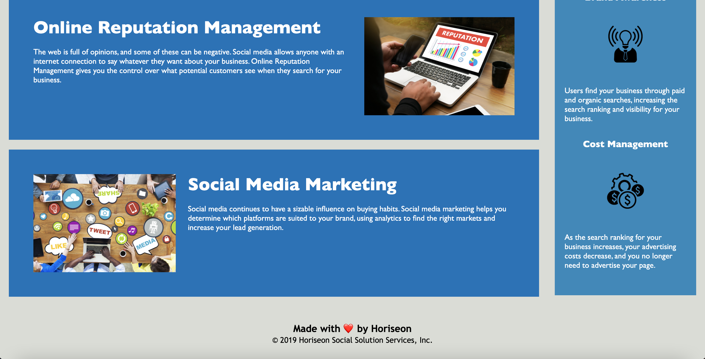

# code-refactor-seo

## Screenshot

## Description 
This project required me to take a starter code and modify it in order to make it accessible. By all means it was imperative that I maintain the visual appearance, as well as the functionality of the webpage. Accessibility is extremely crucial for a website when it comes to improving its ranking on search engine result pages. In other words, this method is called Search Engine Optimization (SEO). From the business model perspective, SEO not only allows you to increase visibility but maximizes the number of visitors to a website by finding the right customers as per its target. As a result, I had to make sure the acceptance criteria are met in order for this webpage to meet the accessibility standards.  

At a glance my first thought was to work on these files (index.html and style.css) in multiple steps and side by side, simultaneously. It didn't make sense to change things around in the HTML file while left with broken code in the CSS file, that too without a proper reference. So, I divided the HTML file in sections namely <header></header> <main></main> and <aside></aside> and within each section worked my way down by working in sub-sections. While at it I followed the semantic structure of the HTML elements and made sure it stands out logically, independent of styling and positioning but still complements the use of CSS selectors and properties with ease. 

From making sure to take care of the <title></title> element, to see none of the <a> links are broken (noting the missing targeted #id), checking all the image  tags have accessible alt attribute to taking note of the class attributes in order to consolidate the CSS code, it was a lot to take in. However, these weren't the only things to look out for. Be it anything big or small that I came across while working on each step of this project, it was a learning process. Not only as a developer, but what are some of the things that could be required of a developer and how to tackle those issues when asked to modify someone else's code. 

## Deployed Application URL
[code-refactor-seo page](https://ssharmin0029.github.io/code-refactor-seo/)

